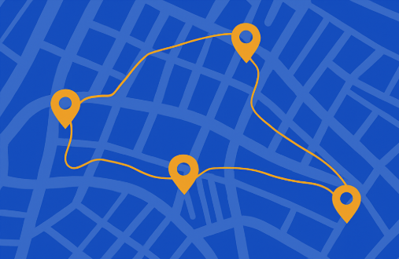

# 🐾 PawPlanner

**Keeping Pets Safe, One Walk at a Time.**  
Never guess if it’s safe to walk your dog again.

---

## 🧭 Overview

**PawPlanner** is a mobile-responsive React app that helps dog owners decide whether it's safe to go for a walk based on real-time weather and surface temperature data.

When walking isn't safe, the app recommends shaded parks and pet-friendly venues nearby using live location data.

---

## 🎯 Features

- ✅ Real-time weather and surface temperature
- ✅ Air quality, UV index, and safety alerts
- ✅ “Safe” or “Unsafe” walking mode
- ✅ Recommended or rerouted pet locations
- ✅ Developer override toggle to simulate conditions
- ✅ Fully responsive UI (mobile + desktop)

---

## 🔧 Technologies Used

- React (via Create React App)
- React Router DOM
- Axios for API calls
- Tomorrow.io Weather API
- Petfinder API
- Material UI (MUI)
- Custom CSS for responsive design

---

## 📸 Screenshots

| Mobile View (Safe) | Desktop View (Split Columns) |
|--------------------|------------------------------|
|  |  |

---

## 🔑 API Keys Required

You must create and add API keys to use the app:

### 1. Tomorrow.io Weather API
🔗 https://app.tomorrow.io/development/keys

- Get your API key
- Used for real-time temperature, UV, air quality, and surface temperature

### 2. Petfinder API
🔗 https://www.petfinder.com/developers/

- Sign up and register an app
- You'll receive a **Client ID** and **Client Secret**

---

## ⚙️ How to Run Locally

### 1. Clone the repo

```bash
git clone https://github.com/YOUR_USERNAME/pawplanner.git
cd pawplanner
